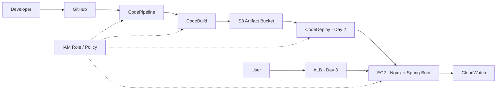

# Mini6 Infra Notes

## Project Structure

```text
mini6/
├─ Frontend/          # React + Vite
├─ Backend/bookapp/   # Spring Boot + Gradle
└─ buildspec.yml      # CodeBuild configuration
```

## Day 1 CI Target

The team can use either one combined pipeline or two separated pipelines.

Recommended separated pipeline structure:

Backend:

```text
GitHub -> CodePipeline -> CodeBuild(buildspec-backend.yml) -> S3 Artifact -> CodeDeploy -> EC2
```

Frontend:

```text
GitHub -> CodePipeline -> CodeBuild(buildspec-frontend.yml) -> S3 static hosting
```

If the team wants a simpler first test, use this flow first:

```text
GitHub -> CodePipeline -> CodeBuild -> S3 Artifact Bucket
```

Do not add EC2 deployment until the build succeeds.

## CodeBuild Behavior

Backend `buildspec-backend.yml` does this:

1. Build backend with `./gradlew clean build`.
2. Export the Spring Boot jar as a build artifact.
3. Include `appspec.yml` and `scripts/**/*` when CodeDeploy files are added.

Frontend `buildspec-frontend.yml` does this:

1. Install frontend dependencies with `npm install`.
2. Build frontend with `npm run build`.
3. Export `Frontend/dist` as a build artifact.

Combined `buildspec.yml` still exists for a one-pipeline test.

Backend artifact output:

```text
build/libs/*.jar
```

Frontend artifact output:

```text
Frontend/dist/*
```

## Current Application Ports

- Frontend local dev: `5173`
- Backend Spring Boot: `8080`
- Backend API base path: `/books`

## CodePipeline Setup

1. Source provider: GitHub via GitHub App.
2. Repository: this `mini6` repository.
3. Branch: `main`.
4. Build provider: AWS CodeBuild.
5. Buildspec file: `buildspec.yml`.
6. Deploy stage: skip on Day 1, add CodeDeploy on Day 2.

## IAM Review Points

Check these as the IAM/AWS reviewer:

- CodePipeline service role can start CodeBuild.
- CodePipeline service role can access the S3 artifact bucket.
- CodeBuild service role can access the S3 artifact bucket.
- CodeBuild service role can write CloudWatch Logs.
- Trust relationship:
  - CodePipeline role: `codepipeline.amazonaws.com`
  - CodeBuild role: `codebuild.amazonaws.com`

## Architecture


